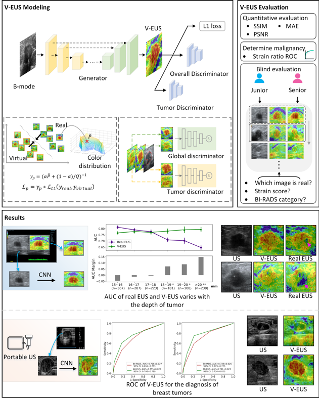

# VEUS
Code for ["Virtual elastography ultrasound via generate adversarial network for breast cancer diagnosis"](https://www.nature.com/articles/s41467-023-36102-1.pdf).

If you find this work useful in your research, please cite 
```
@article{yao2023virtual,
  title={Virtual elastography ultrasound via generative adversarial network for breast cancer diagnosis},
  author={Yao, Zhao and Luo, Ting and Dong, YiJie and Jia, XiaoHong and Deng, YinHui and Wu, GuoQing and Zhu, Ying and Zhang, JingWen and Liu, Juan and Yang, LiChun and others},
  journal={Nature Communications},
  volume={14},
  number={1},
  pages={788},
  year={2023},
  publisher={Nature Publishing Group UK London}
}
```



## Getting start

* python=3.6
* pytorch=1.10.0
* CUDA= 10.2
* torchvision
* cv2

### Prerequisites

### Usage

We partially borrowed the [Pix2pix](https://github.com/junyanz/pytorch-CycleGAN-and-pix2pix) model for this project, many thanks to the author.

